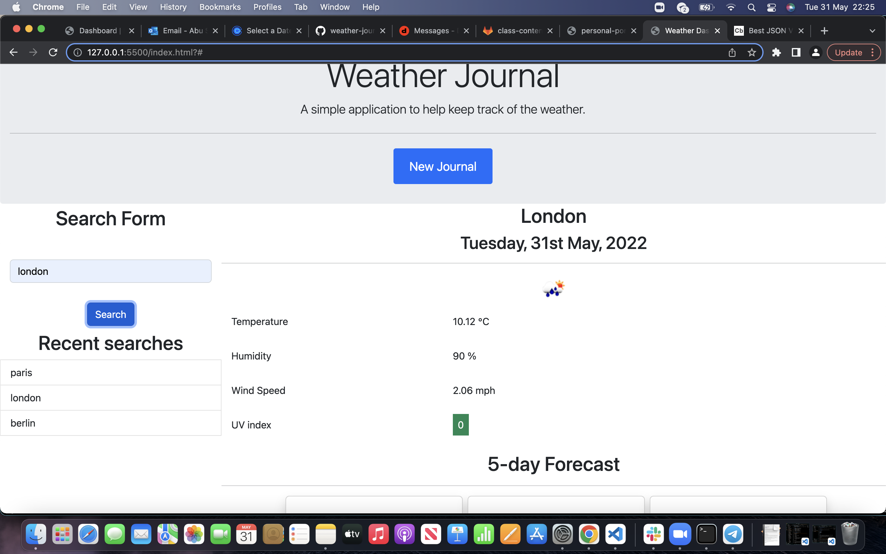
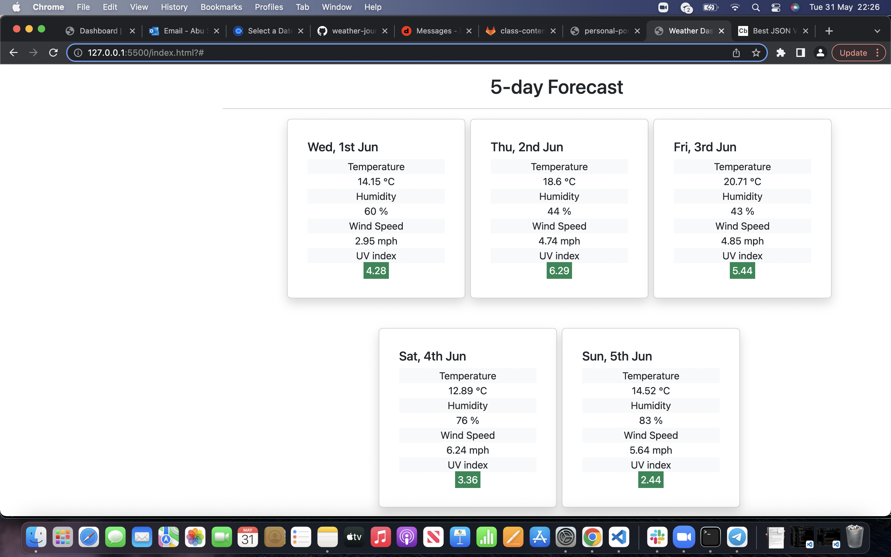
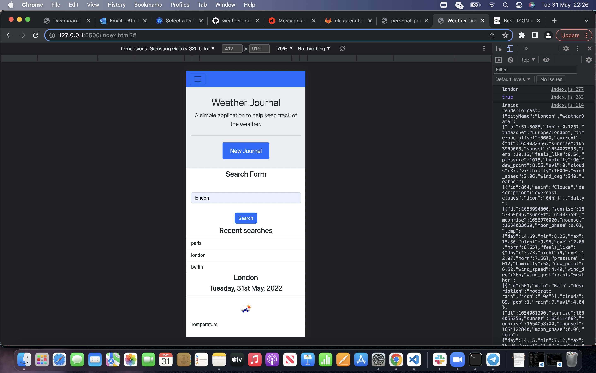
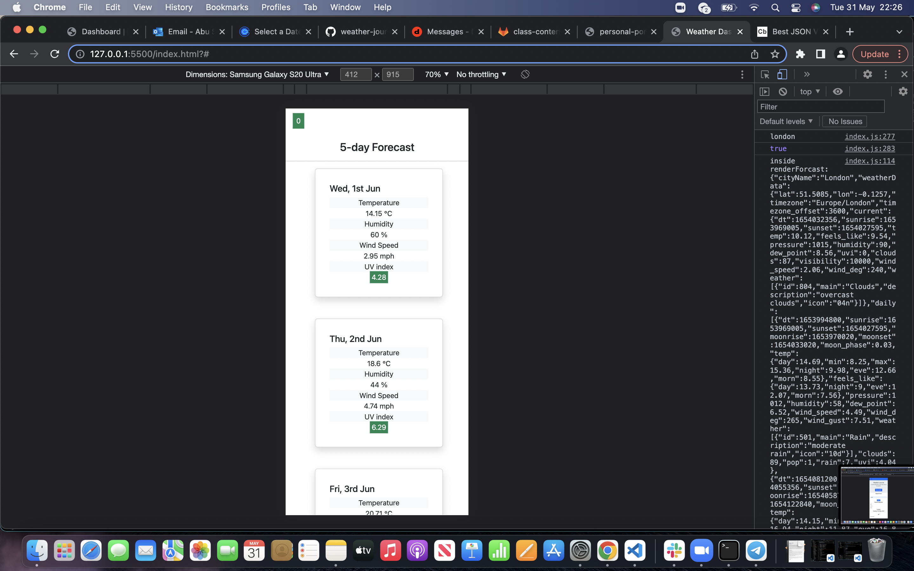

# weather-dashbaord

A functional weather dashboard

## Deployed URL

https://abusaddique95.github.io/weather-dashboard-project/

## Technologies

HTML
CSS
JS
Boostrap
jQuery
Fontawesome
Moment JS

## HTML

For this project I used html to create a skeleton on how i wanted my application to look. Using bootstrap to style, i deisgned each section how i wanted it to look once the application was completed. Once i was happy with the skeleton i deleted the relevant section which were going to be dynamically rendered further on in the application.

## Boostrap

Used Bootstrap to create the styling for the page. Used bootstrap classes to make a functional navbar to navigate around the page. Then used further classes to create forms, saved data. Minimal styling such as margins, padding and borders were given to beautify the page.

## JS

JS was used to prep functions for what we needed the application to do. Event handler was placed of the submit button to listen for clicks and then dynamically render the next screen once it was prompted.

Used jQuery method of template strings to dynamically render the html into JS by passing in data from the API

i Used json.stringify to get the data i needed from the API and then passed it into the template strings to call the data required.

Moment.JS was used to render the date of the current date and the forecast date too.

## Screenshots

## Mobile viewport

